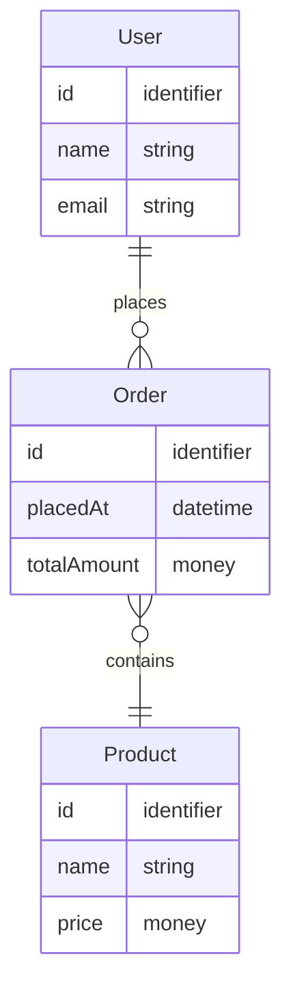

# Domain ERD

비즈니스 도메인의 엔티티와 관계 — **기술/DB 구현에 독립적**. DB 스키마와 일치하지 않을 수 있고, 다른 게 정상입니다(정규화로 join 테이블이 추가되거나, 한 도메인 엔티티가 여러 테이블로 분할되거나).

DB 스키마 ERD 는 별도 — [`../architecture.md`](../architecture.md) 의 "DB 스키마 ERD" 섹션 참조.

## 다이어그램

(위는 예시 — 실제 도메인으로 갱신)

## 갱신 룰

- 도메인 학습/변경 시점에 갱신 (코드보다 *먼저*)
- 컬럼명 대신 *개념 타입* 사용 (`identifier`, `string`, `money`, `datetime`)
- 표시할 것: cardinality(`||`, `o{`, `}o`), 필수 여부, 핵심 속성, 비즈니스 룰
- 표시하지 *않을* 것: 정규화 결과 join 테이블, 인덱스, 물리 컬럼명, FK 명, 타입 정밀도 — 이것들은 DB 스키마 ERD 의 책임
